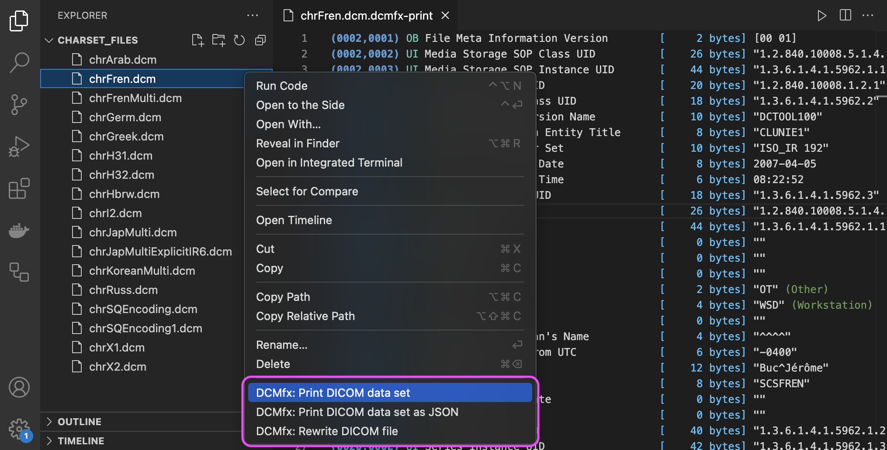

  
  <h1>DCMfx for Visual Studio Code</h1>
  

    <strong>
      VS Code extension for working with DICOM and
       
      DICOM JSON files, built on DCMfx
    </strong>
  

  
  
  

## Demo

## Usage

After installing the extension in VS Code, open a context menu on a DICOM (.dcm)
or DICOM JSON file and select `DCMfx: Print DICOM data set`, or one of the other
available options.

This extension is also available on the Open VSX Registry for users of Eclipse
Theia, VSCodium, Gitpod, and other IDEs that use Open VSX.

## Features

1. Print the content of DICOM and DICOM JSON files.

2. Convert between DICOM files and DICOM JSON files.

3. Rewrite DICOM files to ensure they have correct headers, change their string
   encoding to UTF-8, and correct errors that may prevent use in other software.

## Implementation Notes

1. Supports all valid DICOM files, including all DICOM transfer syntaxes and
   character sets. If you encounter a valid DICOM file that does not work then
   please open an issue.

2. Supports many variations of invalid DICOM files, such as those with no File
   Preamble or invalid/missing File Meta Information.

3. Supports printing truncated and corrupted DICOM files up to the point where
   the data is no longer readable, with detailed error reporting.

4. The DICOM JSON specification is extended to support encapsulated pixel data,
   and the transfer syntax is included so the encapsulated pixel data can be
   correctly parsed.

5. Sequences and sequence items with defined lengths are converted to undefined
   length as part of the read process, so defined lengths are not shown in
   printed output and are not used in any written DICOM files.

6. Encoded DICOM strings are converted to UTF-8 as part of the read process, so
   the Specific Character Set is always 'ISO_IR 192' in both the printed output
   as well as written files, regardless of the character set(s) the source DICOM
   used.

The above behaviors result from how [DCMfx](https://github.com/dcmfx) works.

## Settings

This extension has the following settings:

1. `dcmfx.alwaysShowContextMenuItems`: Whether to always show the DCMfx context
   menu items regardless of the file's extension. Defaults to false.

2. `dcmfx.dicomJsonPrettyPrint`: Whether to pretty print DICOM JSON output with
   whitespace and newlines. Defaults to true.

## Acknowledgements

This extension's VS Code integration points were inspired by
[vscode-dicom-dump](https://github.com/smikitky/vscode-dicom-dump).

## License

DCMfx is published under the GNU Affero General Public License Version 3
(AGPLv3). This license permits commercial use; however, any software that
incorporates DCMfx, either directly or indirectly, must also be released under
the AGPLv3 or a compatible license. This includes making the source code of the
combined work available under the same terms, and ensuring that users who
interact with the software over a network can access the source code.

Copyright © Dr Richard Viney, 2024.
